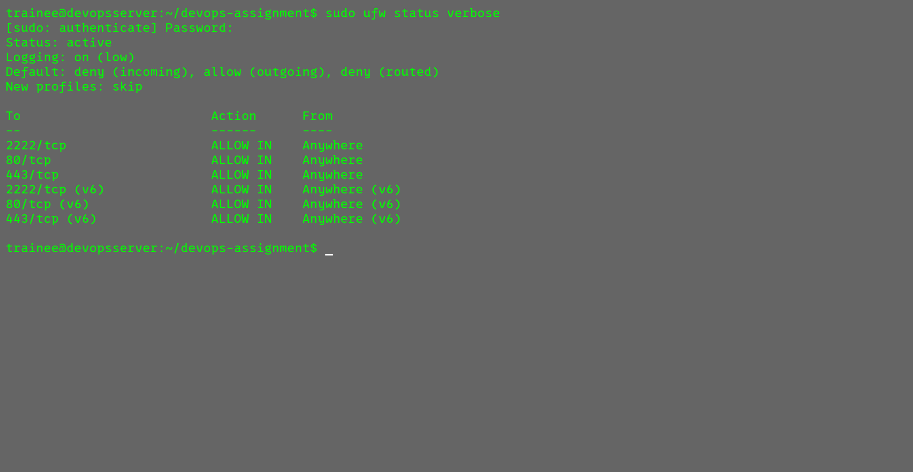
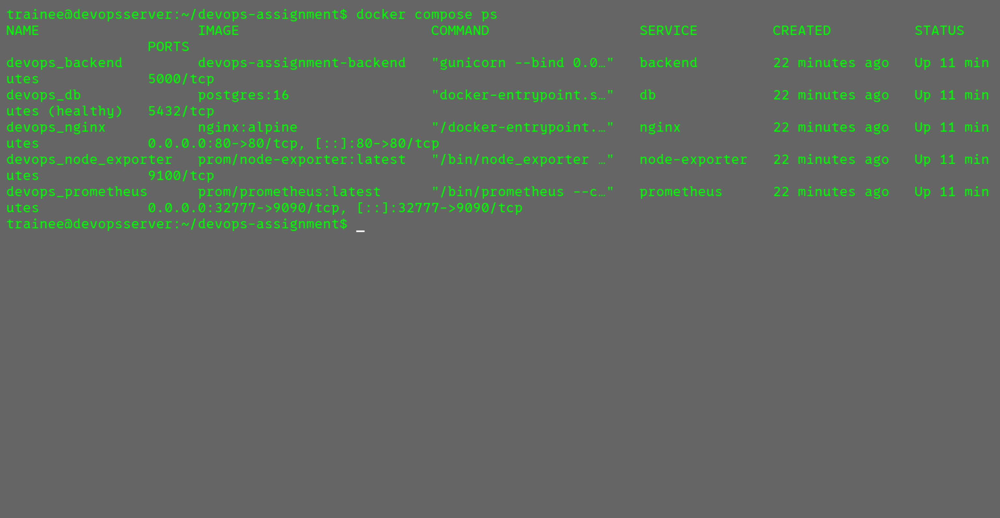
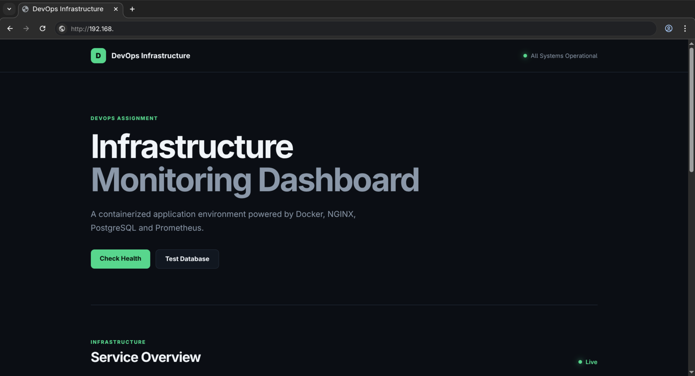
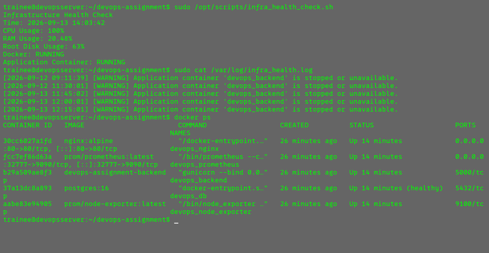
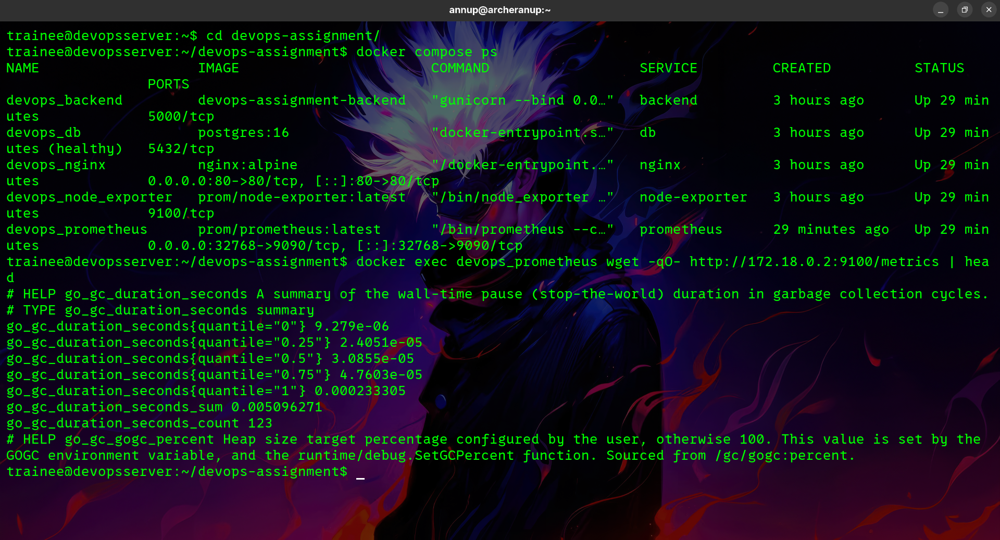
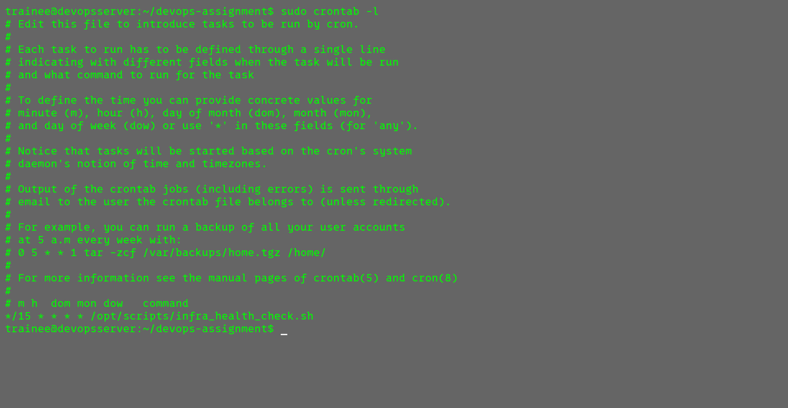

# IT Infrastructure & DevOps Trainee – Practical Implementation

## 1. Project Overview

This project implements an end-to-end Linux and DevOps infrastructure environment using Ubuntu Server, Docker, Docker Compose, Nginx, Flask, PostgreSQL, Bash automation, cron, Prometheus, and Node Exporter.

The implementation demonstrates:

- Linux server provisioning and administration
- SSH hardening and key-based authentication
- UFW firewall configuration
- Docker and Docker Compose
- Nginx reverse proxy
- Containerized Flask backend
- PostgreSQL with persistent storage
- Infrastructure health monitoring
- Automated database backups
- Prometheus and Node Exporter monitoring
- Git branching and documentation

## 2. Architecture

```text
                    Client / Browser
                           |
                           | HTTP :80
                           v
                  +-------------------+
                  |   Nginx Container  |
                  |   Reverse Proxy    |
                  +---------+---------+
                            |
                            | backend:5000
                            v
                  +-------------------+
                  |   Flask Backend    |
                  |   Internal :5000   |
                  +---------+---------+
                            |
                            | PostgreSQL
                            v
                  +-------------------+
                  | PostgreSQL DB      |
                  | Persistent Volume  |
                  +-------------------+

        +-----------------------------+
        | Prometheus                  |
        | Node Exporter               |
        | System Metrics              |
        +-----------------------------+

Ubuntu Server
     |
     +-- SSH :2222
     +-- HTTP :80
     +-- HTTPS :443
     +-- UFW Firewall
```

## 3. Technologies Used

| Component | Technology |
|---|---|
| Operating System | Ubuntu Server |
| Host Environment | QEMU/KVM Virtual Machine |
| SSH | OpenSSH |
| Firewall | UFW |
| Containerization | Docker |
| Orchestration | Docker Compose |
| Reverse Proxy | Nginx |
| Backend | Python Flask |
| Database | PostgreSQL |
| Monitoring | Prometheus |
| Metrics | Node Exporter |
| Automation | Bash |
| Scheduling | Cron |
| Version Control | Git |

## 4. Project Structure

```text
devops-assignment/
├── app/
│   ├── app.py
│   ├── requirements.txt
│   └── Dockerfile
├── nginx/
│   └── nginx.conf
├── prometheus/
│   └── prometheus.yml
├── scripts/
│   ├── infra_health_check.sh
│   └── db_backup.sh
├── screenshots/
│   ├── ufw-status.png
│   ├── docker-ps.png
│   ├── browser-output.png
│   └── health-check.png
├── docker-compose.yml
├── .gitignore
└── README.md
```

## 5. System Provisioning

This project was done using ssh of ubuntu running in VM.

### 5.1 Update Ubuntu

```bash
sudo apt update
sudo apt upgrade -y
```

### 5.2 Install Required Packages

```bash
sudo apt install -y openssh-server ufw git curl cron ca-certificates
```

Enable SSH:

```bash
sudo systemctl enable --now ssh
```

### 5.3 Create Dedicated Trainee User

```bash
sudo adduser trainee
sudo usermod -aG sudo trainee
```

Verify:

```bash
id trainee
```

The `trainee` user is used for administration instead of direct root access.

## 6. SSH Hardening

The SSH service is configured to use port `2222` instead of the default port `22`.

Configuration file:

```text
/etc/ssh/sshd_config
```

Required configuration:

```text
Port 2222
PermitRootLogin no
PubkeyAuthentication yes
PasswordAuthentication no
```

Validate the configuration:

```bash
sudo sshd -t
```

Restart SSH:

```bash
sudo systemctl restart ssh
```

Verify the listening port:

```bash
sudo ss -tlnp | grep ssh
```

SSH access:

```bash
ssh -p 2222 trainee@SERVER_IP
```

## 7. UFW Firewall Configuration

Set default firewall policies:

```bash
sudo ufw default deny incoming
sudo ufw default allow outgoing
```

Allow required services:

```bash
sudo ufw allow 2222/tcp
sudo ufw allow 80/tcp
sudo ufw allow 443/tcp
```

Enable UFW:

```bash
sudo ufw enable
```

Verify:

```bash
sudo ufw status verbose
```

Expected allowed ports:

```text
2222/tcp
80/tcp
443/tcp
```

### Firewall Screenshot



## 8. Docker Installation

Install Docker:

```bash
sudo apt update
sudo apt install -y docker.io docker-compose-v2
```

Enable Docker:

```bash
sudo systemctl enable --now docker
```

Verify:

```bash
docker --version
docker compose version
```

Test Docker:

```bash
sudo docker run hello-world
```

Add the trainee user to the Docker group:

```bash
sudo usermod -aG docker trainee
```

After logging out and back in, verify:

```bash
docker ps
```

## 9. Docker Compose Stack

The application consists of:

1. Nginx reverse proxy
2. Flask backend
3. PostgreSQL database
4. Prometheus
5. Node Exporter

Start the complete stack:

```bash
docker compose up -d --build
```

Check the services:

```bash
docker compose ps
```

or:

```bash
docker ps
```

### Container Screenshot



## 10. Reverse Proxy Configuration

Nginx is exposed on host port `80`.

Traffic flow:

```text
Browser
   |
   | http://SERVER_IP/
   v
Host Port 80
   |
   v
Nginx
   |
   | backend:5000
   v
Flask Application
```

Nginx communicates with the backend using the Docker service name:

```text
backend:5000
```

The Flask application itself is not directly exposed to the host.

### Test Nginx Configuration

```bash
docker exec devops_nginx nginx -t
```

Expected result:

```text
syntax is ok
test is successful
```

### Test Application

From Ubuntu:

```bash
curl http://localhost
```

Test the health endpoint:

```bash
curl http://localhost/health
```

Test database connectivity:

```bash
curl http://localhost/db-test
```

From another machine/browser:

```text
http://SERVER_IP/
```

### Browser Screenshot



## 11. PostgreSQL Persistent Storage

PostgreSQL uses a Docker named volume:

```yaml
volumes:
  postgres_data:
```

The volume is mounted to:

```text
/var/lib/postgresql/data
```

This ensures database data persists when the PostgreSQL container is restarted or recreated.

Check volumes:

```bash
docker volume ls
```

## 12. Infrastructure Health Check

The health-check script is located at:

```text
/opt/scripts/infra_health_check.sh
```

The script checks:

- CPU utilization
- RAM utilization
- Root disk utilization
- Docker service status
- Web application container status

If root disk usage exceeds `85%`, or the application container is stopped, the script:

1. Prints a `[WARNING]` message.
2. Appends a timestamped entry to `/var/log/infra_health.log`.

### Run Manually

```bash
sudo /opt/scripts/infra_health_check.sh
```

View the log:

```bash
sudo cat /var/log/infra_health.log
```

### Test Application Failure

Stop the backend:

```bash
docker stop devops_backend
```

Run the health check:

```bash
sudo /opt/scripts/infra_health_check.sh
```

A warning should be generated.

Restart the application:

```bash
docker start devops_backend
```

### Health Check Screenshot



## 13. Cron Automation

The health-check script runs automatically every 15 minutes.

Edit the root crontab:

```bash
sudo crontab -e
```

Add:

```cron
*/15 * * * * /opt/scripts/infra_health_check.sh
```

Verify:

```bash
sudo crontab -l
```

Expected:

```text
*/15 * * * * /opt/scripts/infra_health_check.sh
```

## 14. Database Backup

The database backup script is:

```text
/opt/scripts/db_backup.sh
```

Backup location:

```text
/var/backups/db/
```

Run the backup manually:

```bash
sudo /opt/scripts/db_backup.sh
```

Check generated backups:

```bash
sudo ls -lh /var/backups/db/
```

Backup filenames use a timestamp:

```text
db_backup_YYYYMMDD_HHMMSS.sql.gz
```

Example:

```text
db_backup_20260913_173000.sql.gz
```

## 15. Database Restore

The PostgreSQL backup is compressed using gzip.

To restore a backup:

```bash
gunzip -c /var/backups/db/db_backup_YYYYMMDD_HHMMSS.sql.gz \
| docker exec -i devops_db psql -U devops -d devopsdb
```

Replace the filename with the actual backup file.

Verify the database:

```bash
docker exec -it devops_db psql -U devops -d devopsdb
```

Inside PostgreSQL:

```sql
\dt
```

Exit:

```sql
\q
```

## 16. Monitoring

Prometheus and Node Exporter are used for basic system metrics collection.

### Node Exporter

Node Exporter exposes system metrics internally on:

```text
node-exporter:9100
```

### Prometheus

Prometheus collects metrics from Node Exporter.

The Prometheus configuration is stored in:

```text
prometheus/prometheus.yml
```

Verify the containers:

```bash
docker ps
```

Check Prometheus logs:

```bash
docker logs devops_prometheus
```

Check Node Exporter logs:

```bash
docker logs devops_node_exporter
```

Test metrics from the Docker network:

```bash
docker exec devops_prometheus wget -qO- http://node-exporter:9100/metrics | head
```

Prometheus is kept internal to the Docker network and is not directly exposed through the host firewall.

## 17. Useful Docker Commands

Check running containers:

```bash
docker ps
```

Check all containers:

```bash
docker ps -a
```

Check Compose services:

```bash
docker compose ps
```

View logs:

```bash
docker compose logs
```

View a specific service:

```bash
docker compose logs backend
```

Restart services:

```bash
docker compose restart
```

Stop the stack:

```bash
docker compose down
```

Stop and remove volumes:

```bash
docker compose down -v
```

Rebuild and start:

```bash
docker compose up -d --build
```

## 18. Verification Checklist

Before submission, verify the following.

### System Security

```bash
whoami
id trainee
sudo ufw status verbose
sudo ss -tlnp | grep ssh
```

Verify SSH access:

```bash
ssh -p 2222 trainee@SERVER_IP
```

### Docker

```bash
docker ps
docker compose ps
```

### Nginx

```bash
docker exec devops_nginx nginx -t
curl http://localhost
```

### Database

```bash
curl http://localhost/db-test
docker volume ls
```

### Health Check

```bash
sudo /opt/scripts/infra_health_check.sh
sudo cat /var/log/infra_health.log
```

### Cron

```bash
sudo crontab -l
```

### Backup

```bash
sudo /opt/scripts/db_backup.sh
sudo ls -lh /var/backups/db/
```

### Monitoring

```bash
docker logs devops_prometheus
docker logs devops_node_exporter
```

## 19. Teardown

Stop and remove the application containers:

```bash
docker compose down
```

To also remove the PostgreSQL persistent volume:

```bash
docker compose down -v
```

> **Warning:** Removing the volume deletes the PostgreSQL data stored in the Docker volume.

## 20. Git Workflow

The project uses separate feature branches for different configuration tasks.

Example branches:

```text
main
├── feature/docker-setup
├── feature/scripts
└── Documentation
```

Create the Docker branch:

```bash
git checkout -b feature/docker-setup
```

Commit changes:

```bash
git add app/ nginx/ prometheus/ docker-compose.yml .gitignore
git commit -m "feat: add Docker web stack and reverse proxy"
```

Create the scripts branch:

```bash
git checkout main
git checkout -b feature/scripts
```

Commit scripts:

```bash
git add scripts/
git commit -m "feat: add infrastructure health and database backup scripts"
```

Merge branches into main:

```bash
git checkout main
git merge feature/docker-setup
git merge feature/scripts
```

View branch history:

```bash
git log --oneline --all --graph
```

View branches:

```bash
git branch
```

Push branches to the remote repository:

```bash
git push -u origin main
git push -u origin feature/docker-setup
git push -u origin feature/scripts
```

Pull changes from main barnch to feature/docker-setup
```bash
git switch main
git pull origin main
git switch feature/docker-setup
git merge main
```

## 21. Submission Evidence

The following screenshots are included as verification evidence:

| Screenshot | Purpose |
|---|---|
| `screenshots/ufw-status.png` | UFW firewall configuration |
| `screenshots/docker-ps.png` | Running Docker containers |
| `screenshots/browser-output.png` | Nginx reverse proxy and Flask response |
| `screenshots/health-check.png` | Health-check execution and warning/log output |

## 22. Final Verification

The final environment provides:

- Dedicated `trainee` administrative user
- SSH hardening on port `2222`
- Disabled direct root SSH login
- Key-based SSH authentication
- UFW firewall allowing ports `2222`, `80`, and `443`
- Docker multi-service deployment
- Nginx reverse proxy
- Internal Flask backend
- PostgreSQL persistent storage
- Automated infrastructure health checks
- 15-minute cron execution
- Automated compressed database backups
- Documented database restoration procedure
- Prometheus and Node Exporter monitoring
- Git feature branches and meaningful commits

---

## Author

**IT Infrastructure & DevOps Trainee Practical Implementation**

Environment:

```text
Ubuntu Server
Docker
Docker Compose
Nginx
Flask
PostgreSQL
Prometheus
Node Exporter
Bash
Git
```

### Other noticiable Screenshot



